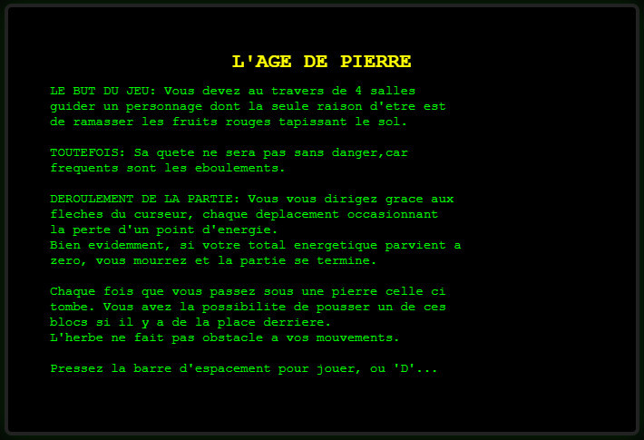
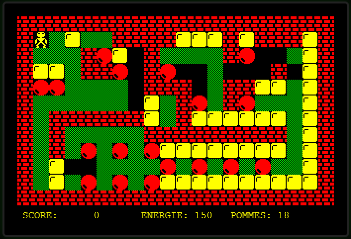

# L'Âge de Pierre

Une adaptation web du célèbre jeu Amstrad CPC "L'Age de Pierre", inspiré du programme original de Stéphane VALLOIS en 1985, réalisée avec HTML, CSS et JavaScript.

A web adaptation of the classic Amstrad CPC game "L'Age de Pierre", inspired by the original 1985 program by Stéphane VALLOIS, built with HTML, CSS and JavaScript.

<p align="center">
  
</p>

---

## FRANÇAIS

### Description

L'Âge de Pierre est un petit jeu de plateforme / puzzle en style rétro, inspiré du rendu visuel et de la philosophie des jeux Amstrad CPC des années 1980.

Le joueur explore un niveau, évite les pièges, collecte des objets et progresse au fil des défis. Cette version a été adaptée pour le navigateur avec un rendu pixel-art et une ambiance CRT.

### Fonctionnalités

- Graphismes pixel-art inspirés des années 1980
- Contrôles au clavier
- Niveaux progressifs
- Sons synthétiques inspirés de la génération Amstrad CPC
- Compatible navigateur moderne

### Contrôles

- Flèches directionnelles : déplacement
- Espace : jouer / lancer la partie
- D : démonstration des niveaux

### Accès au jeu

Le projet est accessible via GitHub Pages :

```text
https://the-real-dje33.github.io/l-age-de-pierre/
```

### Screenshots

<p align="center">
  
  
</p>

### Structure du projet

```text
.
├── index.html
├── style.css
├── script.js
└── README.md
```

### Crédits

- Adaptation web : contribution locale / adaptation numérique
- Jeu original : Stéphane VALLOIS (1985)
- Ressources visuelles et références : CPC-Power

### Remerciements

Merci à la communauté Amstrad CPC, à CPC-Power et à tous ceux qui ont contribué à préserver la culture de ces jeux classiques.

---

## ENGLISH

### Description

L'Âge de Pierre is a small retro-inspired platform / puzzle game, drawing from the visual style and spirit of Amstrad CPC games from the 1980s.

The player explores a level, avoids traps, collects items, and progresses through increasingly challenging stages. This version has been adapted for the browser using pixel-art graphics and a CRT-inspired aesthetic.

### Features

- Pixel-art graphics inspired by the 1980s
- Keyboard controls
- Progressive levels
- Synth-like sounds inspired by the Amstrad CPC era
- Compatible with modern browsers

### Controls

- Arrow keys: move
- Space: play / start the game
- D: level demo

### Access the game

The project is available through GitHub Pages:

https://the-real-dje33.github.io/l-age-de-pierre/


### Screenshots

<p align="center">
  
  
</p>

### Project structure

```text
.
├── index.html
├── style.css
├── script.js
└── README.md
```

### Credits

- Web adaptation: local / digital adaptation
- Original game: Stéphane VALLOIS (1985)
- Visual resources and references: CPC-Power

### Acknowledgements

Thanks to the Amstrad CPC community, CPC-Power, and everyone who helped preserve the legacy of these classic games.

---


## GitHub

- Dépôt GitHub : https://github.com/the-real-dje33/l-age-de-pierre
- GitHub repository: https://github.com/the-real-dje33/l-age-de-pierre

---

## 🕹️ À propos

Ce projet revisite un classique de la scène Amstrad CPC dans un format jouable directement dans le navigateur, avec une esthétique rétro et une ambiance fidèle à l'époque.

This project revisits a classic of the Amstrad CPC scene in a browser-playable format, with a retro aesthetic and a mood faithful to the era.
